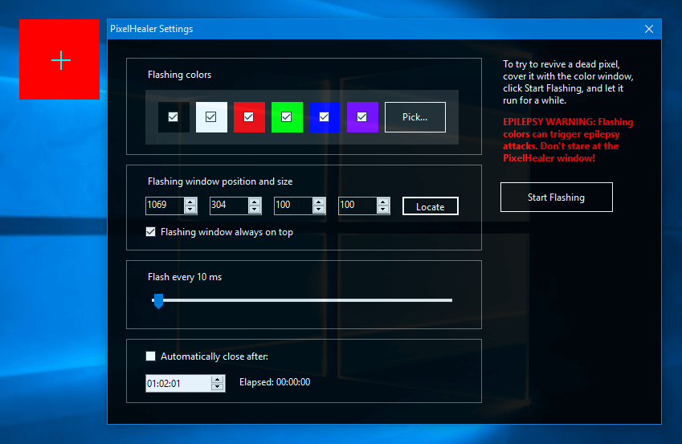

# PixelHealer
PixelHealer can help you try to fix dead pixels by yourself, before running back to the store! You can use it to fix dead, stuck or 
hot pixels on LCD or TFT screens, on desktop monitors, laptops or tablets.

PixelHealer uses the already tested concept that flashing
RGB colors over a dead or stuck pixel will revive it. All you have to do is run PixelHealer, cover the dead pixel with the colored
repair window, and click Start Flashing. Let the repair window run for a while, then check to see if the pixel has been fixed
or revived. And repeat the process if necessary. 

PixelHealer has an intuitive interface and it is very easy to use. Use the mouse or your finger to move or resize the repair window.
Open the intuitive Settings window to change the flashing colors, the flashing interval, or to automatically close the app after a
certain period of time.

## Quotes

> "A kind of shock treatment for pixels" (Omicrono)

> "No prior knowledge is required, PixelHealer performs its duty even without installation." (CHIP Verdict: Gut)

> "An effective and money-saving solution for dead or stuck pixels on your computer screen." (Download3K: Excellent)

> "It may be worth a shot considering that the only other options you have are to return the screen/buy a new one or to live with it." (Ghacks Technology News)

[More Reviews](https://www.aurelitec.com/pixelhealer/windows/reviews/)

## Download

The latest stable version of PixelHealer can be downloaded from [Aurelitec](https://www.aurelitec.com/pixelhealer/windows/download/). You can download the Installation package, or a fully portable edition that does not require installation. PixelHealer runs on Windows 10, 8, 7, Vista, and XP.

## Source Code

PixelHealer is written in C# using Windows Forms and .NET Framework 2.0. The project is developed using Visual Studio Community 2015, with the help of [StyleCop.Analyzers](https://github.com/DotNetAnalyzers/StyleCopAnalyzers).

## Contributions

Contributions are welcome: code, text, documentation, design, graphics, suggestions. Please fork this repository and contribute back using [pull requests](https://github.com/aurelitec/pixelhealer-windows/pulls), [submit an issue](https://github.com/aurelitec/pixelhealer-windows/issues), or [send an email](https://www.aurelitec.com/support/).

## Author

PixelHealer for Windows was created in 2012 by [Horațiu Tănescu](https://horatiu.me), cofounder of [East-Tec](https://www.east-tec.com) and original creator of [east-tec Eraser](https://www.east-tec.com/eraser/), the privacy solution that quickly and securely covers your online and PC tracks.

## License

PixelHealer is licensed under the [MIT license](LICENSE).
